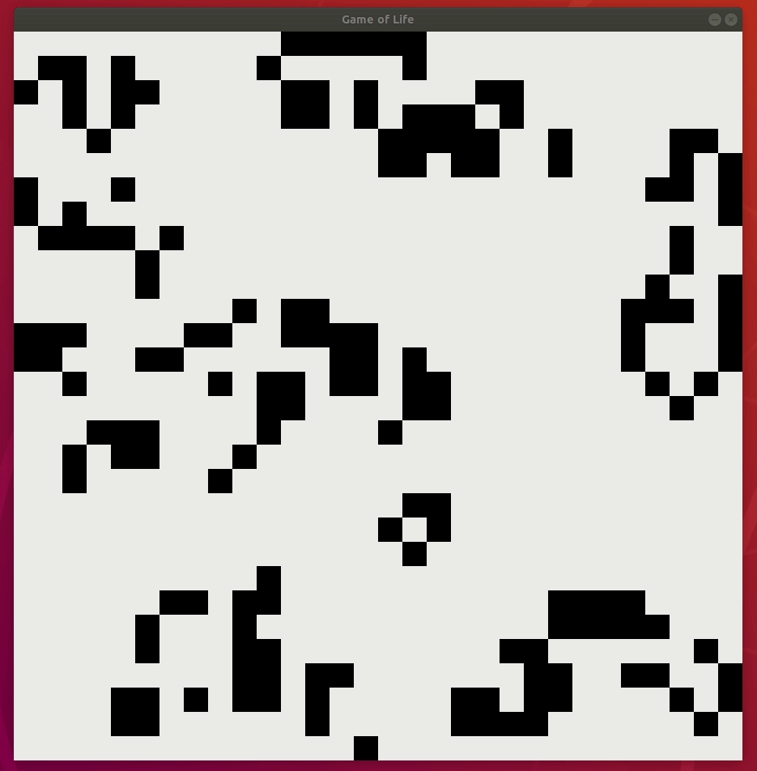
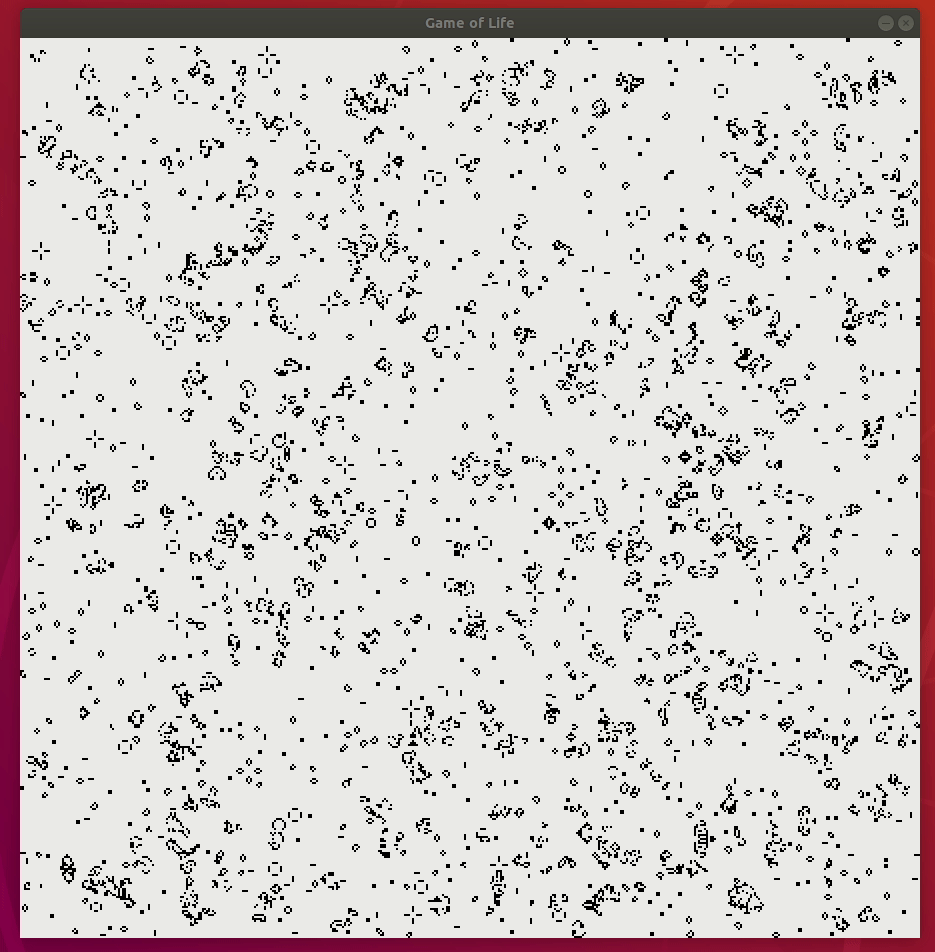

# Conway's Game of Life

## About

This is a simple implementation of [Conway's Game of Life](https://en.wikipedia.org/wiki/Conway%27s_Game_of_Life) using Go language.

The engine used for visualization is a library called [raylib](https://github.com/gen2brain/raylib-go) which is an OpenGL abstraction to render the pixels animation.

## Requirements

### Development

This project has 2 main dependencies for it to work:

- Go 1.13 >=

After installed, you can use the following command to verify:

```shell
$ go version

go version go1.13.4 linux/amd64
```

- [raylib](https://github.com/gen2brain/raylib-go)

```shell
go get -v -u github.com/gen2brain/raylib-go/raylib
```

The library needs a couple of packages that need to be installed before to work. For further and more detailed instructions, you can follow directly the instructions directly on it's Github, as it depends on your Operative System.

The rest of the dependencies are handled by `go mod` itself. If you are having trouble with them, you can use `go mod download` to install the packages.

## Running the project

Go projects have the singularity that the entrypoint, or main function, commonly lives inside the `/cmd` directory.

In order to run the project, you have to use the following command:

```shell
go run cmd/main.go
```

And that's it!

If dependencies are correctly installed, you will see a working *(and mesmerizing)* cellular automata in action.

Disclaimer: For now, the only way to change the Game's configuration is by changing the default values in main. Next version will support the usage of flags to modify it's execution

## Samples

Preview of Conway's Game of Life in action with differente scales and configurations.

### Medium

Screen: 900x900

Game-grid: 30x30

FPS: 1



### Big

Screen: 900x900

Game-grid: 450x450

FPS: 30


